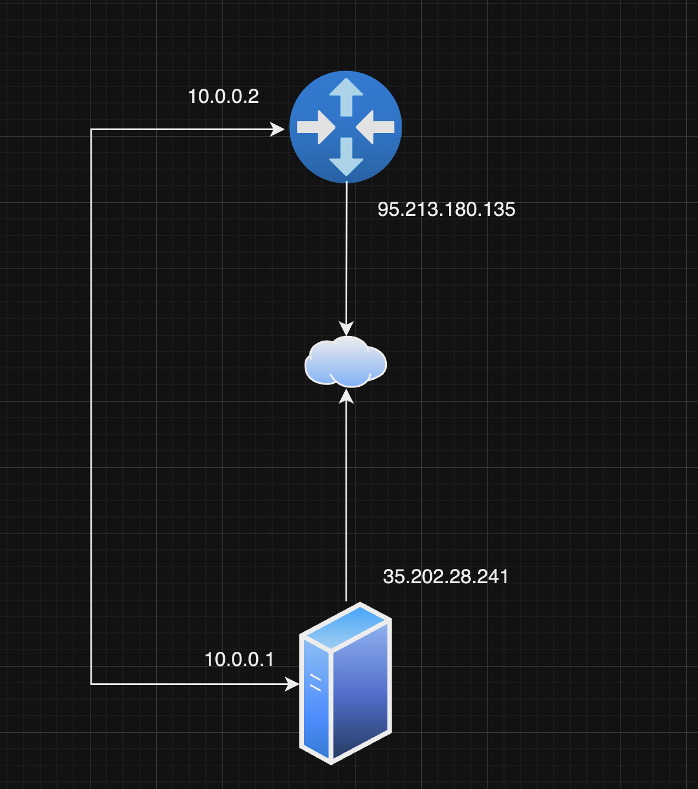
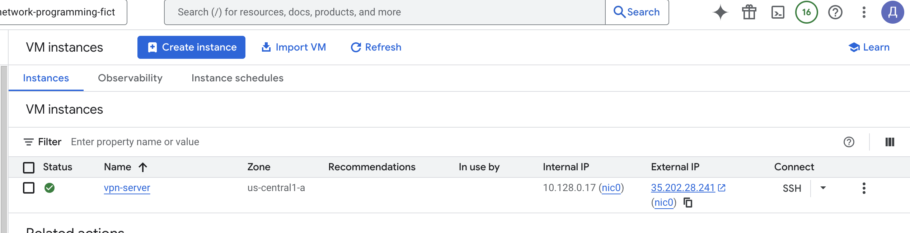
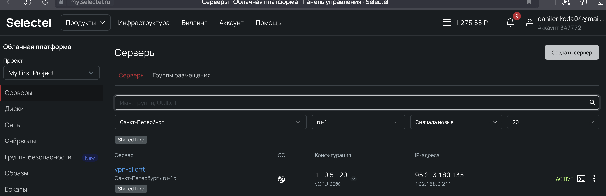
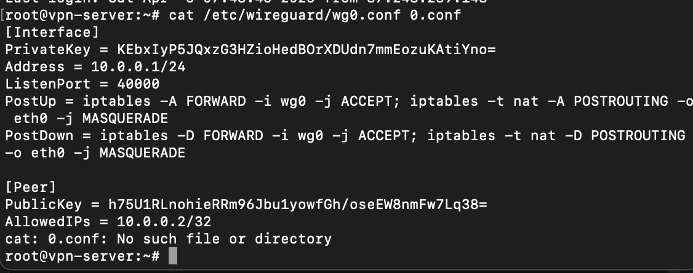
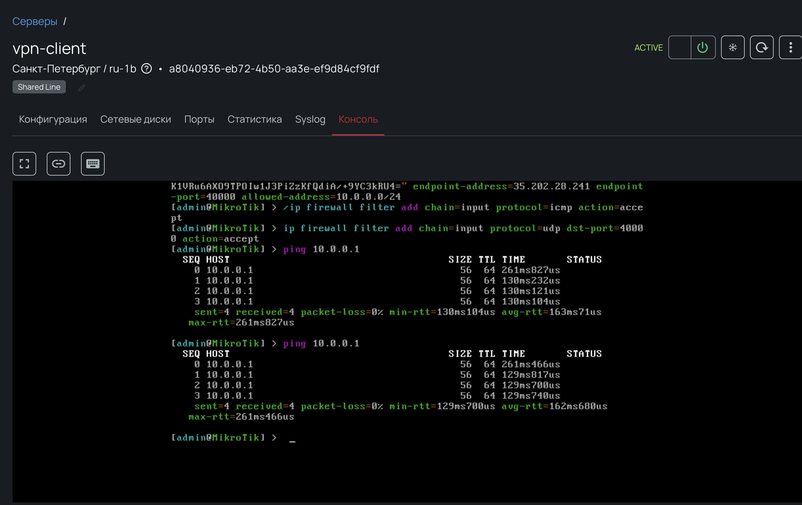

University: [ITMO University](https://itmo.ru/ru/)  
Faculty: [FICT](https://fict.itmo.ru)  
Course: [Network programming]([https://github.com/itmo-ict-faculty/introduction-in-routing](https://itmo-ict-faculty.github.io/network-programming/))  
Year: 2024/2025  
Group: K3323  
Author: Danilenko Dmitriy Alexandrovich  
Lab: Lab1  
Date of create: 22.03.2025  
Date of finished:  05.04.2025  

# Схема



# Ход работы

Для выполнения лабораторной нам потребуется две виртуальные машины: vpn-server и vpn-client.

vpn-server развернем в gcp




vpn-client развернем в Selectel из образа chr-7.18.2



На vpn-server установили python и ansible

```
sudo apt install python3-pip
ls -la /usr/bin/python3.6
sudo pip3 install ansible
```


На vpn-server установили, сконфигурировали и запустили wireguard

```
sudo apt install wireguard
wg genkey | sudo tee /etc/wireguard/private.key
sudo cat /etc/wireguard/private.key | wg pubkey | sudo tee /etc/wireguard/public.key
sudo ufw allow 40000/udp
sudo systemctl enable wg-quick@wg0
sudo systemctl start wg-quick@wg0
```



На vpn-client сконфигурируем интерфейс wg

```
/interface wireguard add name=wg0  
/interface wireguard print
/ip address add address=10.0.0.2/24 interface=wg0 
/interface wireguard peers add interface=wg0 public-key="public key" endpoint-address=35.202.28.241 endpoint-port=40000 allowed-address=10.0.0.0/24   
/ip firewall filter add chain=input protocol=icmp action=accept
/ip firewall filter add chain=input protocol=udp dst-port=40000 action=accept 
```

Проверим связность


