University: [ITMO University](https://itmo.ru/ru/)
Faculty: [FICT](https://fict.itmo.ru)
Course: [Network programming]([https://github.com/itmo-ict-faculty/introduction-in-routing](https://itmo-ict-faculty.github.io/network-programming/))
Year: 2024/2025
Group: K3323
Author: Danilenko Dmitriy Alexandrovich
Lab: Lab2
Date of create: 24.05.2025
Date of finished:

# Схема

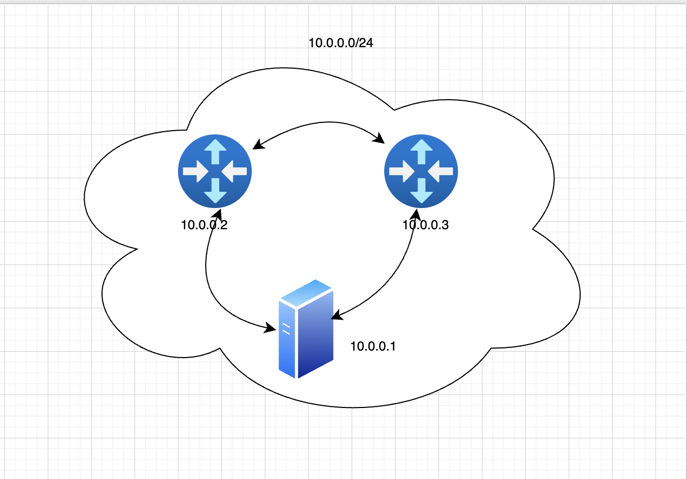

# Ход работы

Для выполнения лабораторной поднимем еще один роутер и настроим vpn.

Проверим связность сервера с клиентами
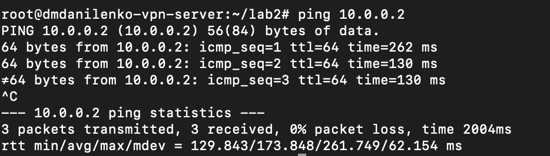
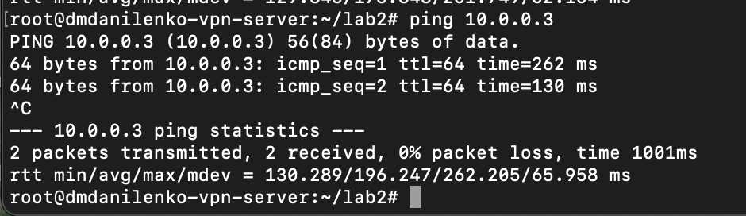
Соберем инвентарь ansible
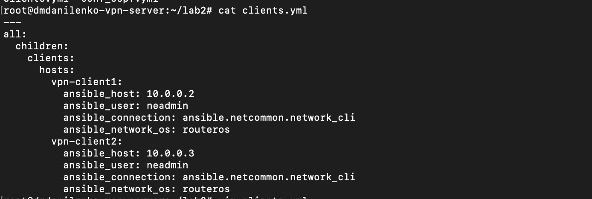
Напишем ansible playbook
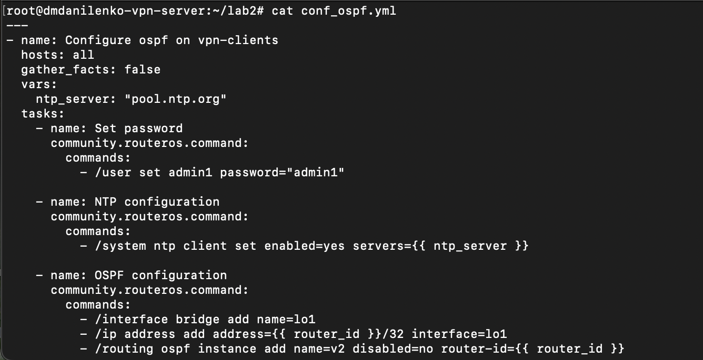
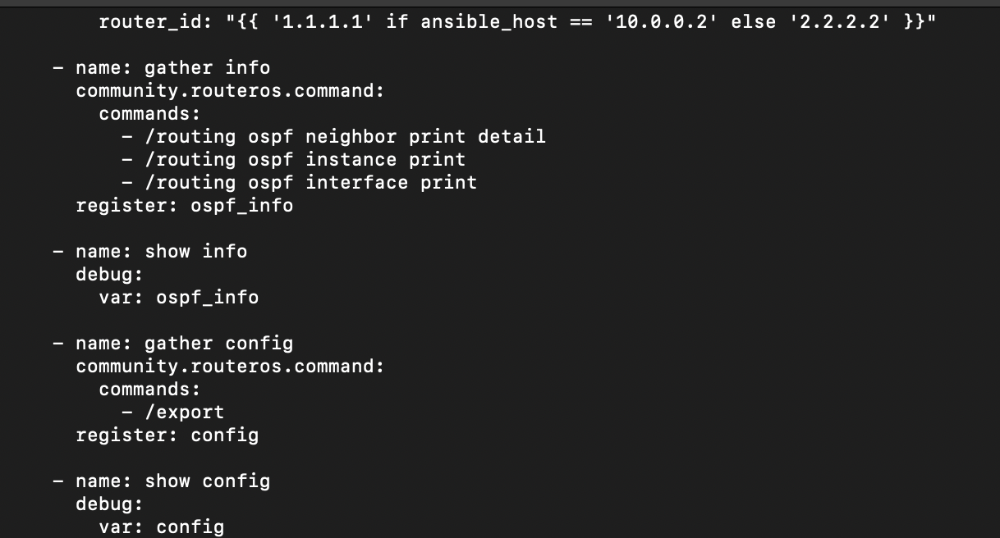
Проверим доступность хостов в инвентаре
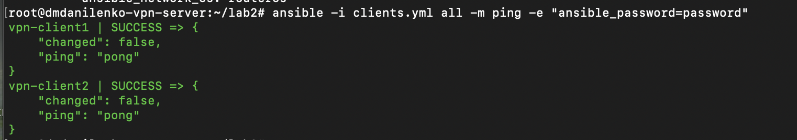
Запустим плейбук и проверим что все таски выполнились корректно
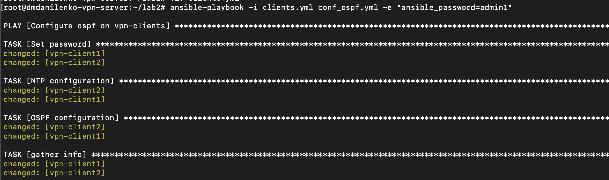
Перейдем на chr и проверим что ospf настроился корректно
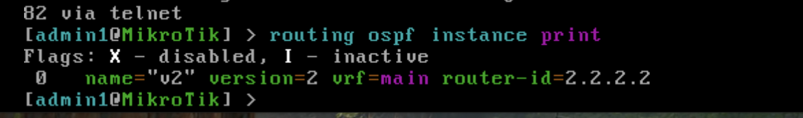
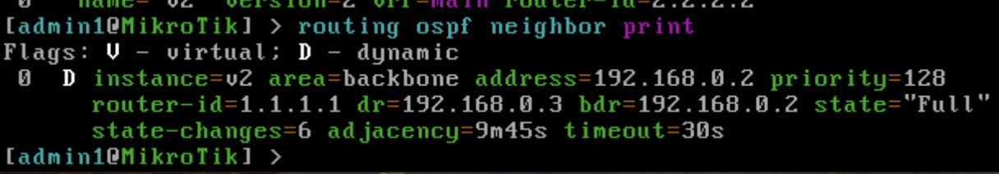
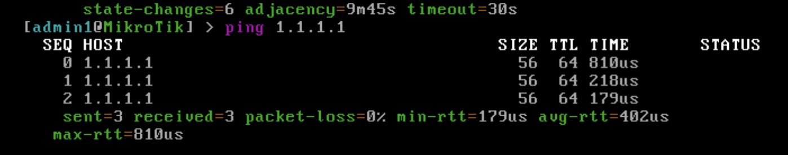
