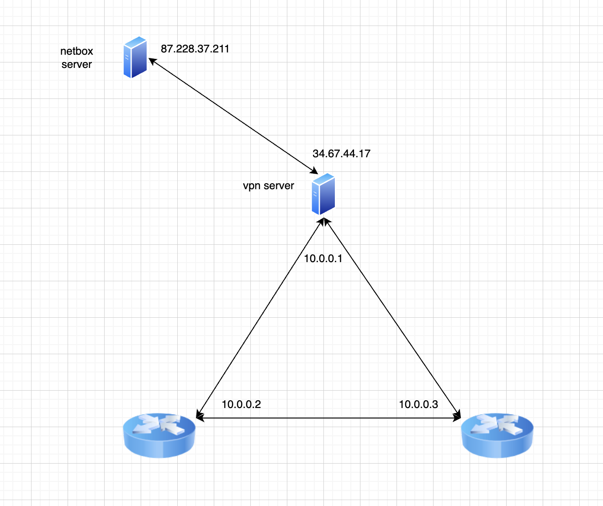
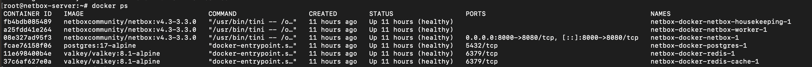
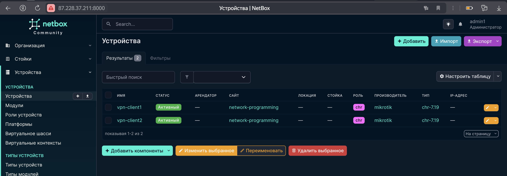
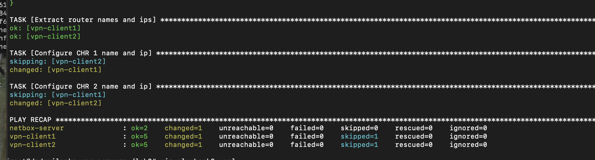
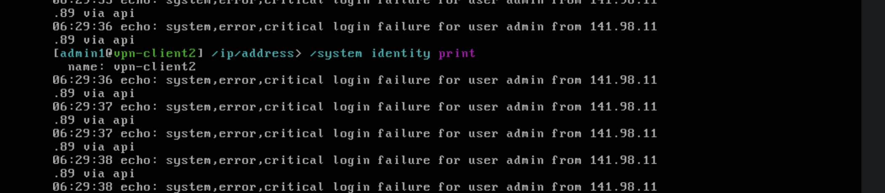
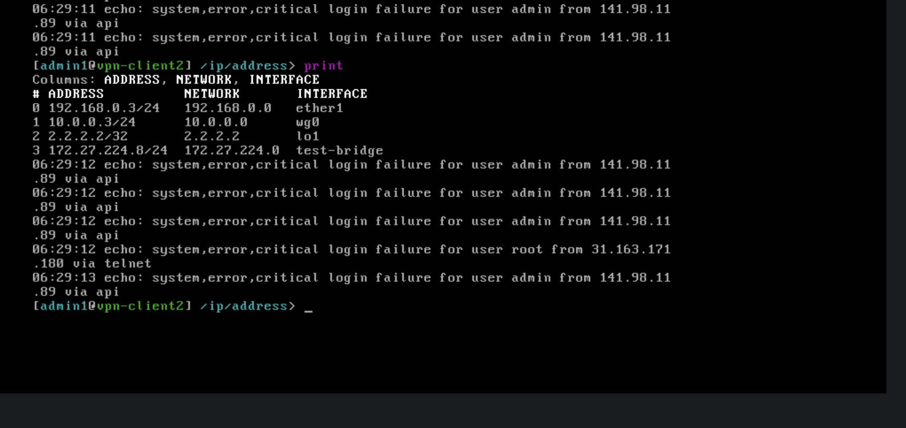
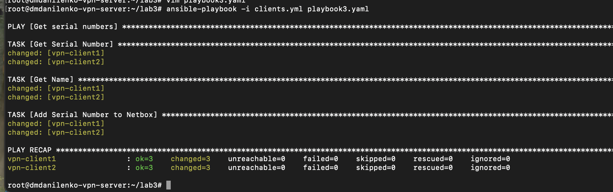
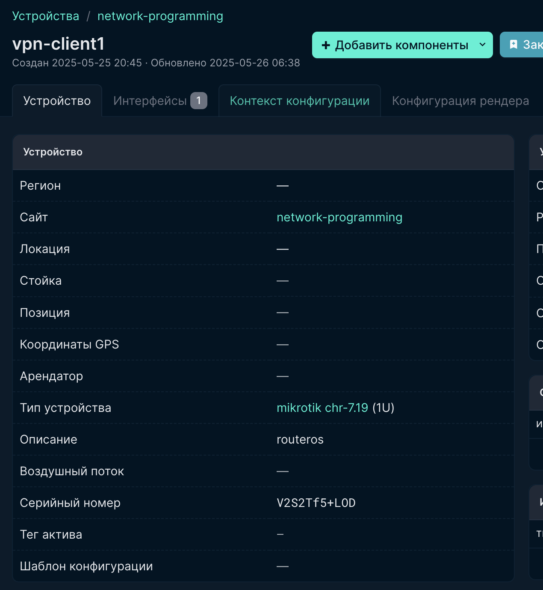

# Лабораторная работа №3 "Развертывание Netbox, сеть связи как источник правды в системе технического учета Netbox"

University: [ITMO University](https://itmo.ru/ru/)
Faculty: [FICT](https://fict.itmo.ru)
Course: [Network programming]([https://github.com/itmo-ict-faculty/introduction-in-routing](https://itmo-ict-faculty.github.io/network-programming/))
Year: 2024/2025
Group: K3323
Author: Danilenko Dmitriy Alexandrovich
Lab: Lab3
Date of create: 24.05.2025
Date of finished:

## Схема



## Ход работы

Развернули дополнительный сервер netbox (я развернул в Selectel). Установили docker, python и подняли netbox в контейнерах



Добавили записи об устройствах и ip адреса для выполнения последующих заданий



Написали [playbook](files/lab3/playbook1.yaml) для первого задания и выполнили его на vpn-server.

playbook1:

```
---
- name: Collect data
  hosts: netbox
  gather_facts: no
  tasks: 
    - name: Get netbox devices data
      set_fact:
        devices: "{{ query('netbox.netbox.nb_lookup', 'devices', api_endpoint=api_endpoint, token=token, validate_certs=false) }}"

    - name: Save data to file
      copy:
        content:
          - "{{ devices }}"
        dest: devices.json
      delegate_to: localhost

```

Получили файл [devices.json](files/lab3/devices.json)

Написали [playbook](files/lab3/playbook2) для второго задания и выполнили его

```
- name: Collect netbox data
  hosts: netbox
  gather_facts: no
  tasks:
    - name: Get netbox devices data
      set_fact:
        devices: "{{ query('netbox.netbox.nb_lookup', 'devices', api_endpoint=api_endpoint, token=token, validate_certs=false) }}"

    - name: Save data to file
      copy:
        content:
          - "{{ devices }}"
        dest: devices.json
      delegate_to: localhost

- name: Configure CHR
  hosts: clients
  gather_facts: no
  tasks:
    - name: Download data
      ansible.builtin.slurp:
        src: "./devices.json"
      register: netbox_data_file
      delegate_to: localhost

    - name: Parse data
      ansible.builtin.set_fact:
        devices: "{{ netbox_data_file.content | b64decode | from_json }}"

    - name: Debug
      ansible.builtin.debug:
        var: devices

    - name: Extract router names and ips
      set_fact:
        router1_name: "{{ devices[0][0].value.name }}"
        router1_ip: "{{ devices[0][0].value.primary_ip4.address }}"
        router2_name: "{{ devices[0][1].value.name }}"
        router2_ip: "{{ devices[0][1].value.primary_ip4.address }}"

    - name: Configure CHR 1 name and ip
      community.routeros.command:
        commands:
          - /ip address add address={{ router1_ip }} interface=test-bridge
          - /system identity set name={{ router1_name }}
      when: inventory_hostname == 'vpn-client1'

    - name: Configure CHR 2 name and ip
      community.routeros.command:
        commands:
          - /ip address add address={{ router2_ip }} interface=test-bridge
          - /system identity set name={{ router2_name }}
      when: inventory_hostname == 'vpn-client2'

```



Проверили что на клиентах добавился ip адрес на тестовый интерфейс и изменилось название system





Написали [playbook](files/lab3/playbook3.yaml) для третьего задания и выполнили его

```
---
- name: Get serial numbers
  hosts: clients
  gather_facts: False
  tasks:
    - name: "Get Serial Number"
      community.routeros.command:
        commands:
          - /system license print
      register: license

    - name: "Get Name"
      community.routeros.command:
        commands:
          - /system identity print
      register: identity
  
    - name: Add Serial Number to Netbox
      netbox_device:
        netbox_url: http://87.228.37.211:8000
        netbox_token: token
        data:
          name: "{{ identity.stdout_lines[0][0].split()[1] }}"
          serial: "{{ license.stdout_lines[0][0].split()[1] }}"

```



В netbox у устройств появился серийный номер


