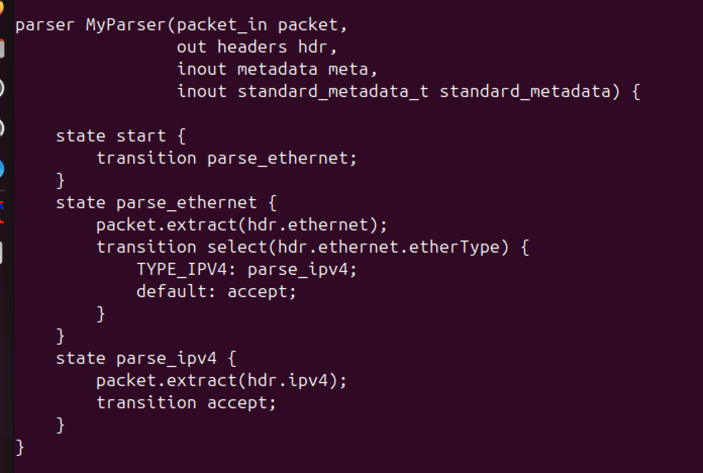
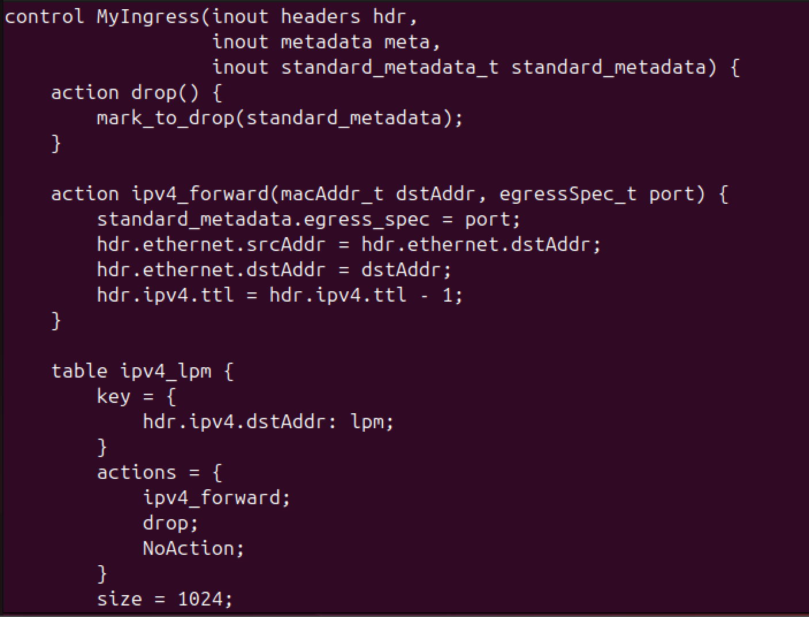
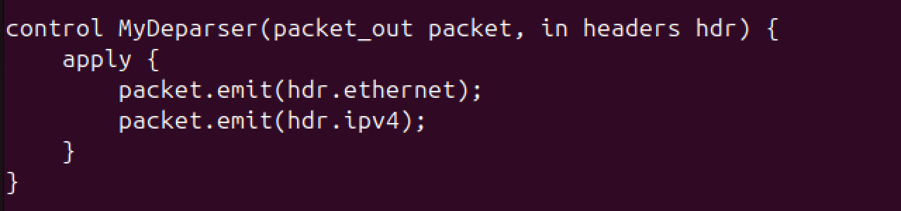
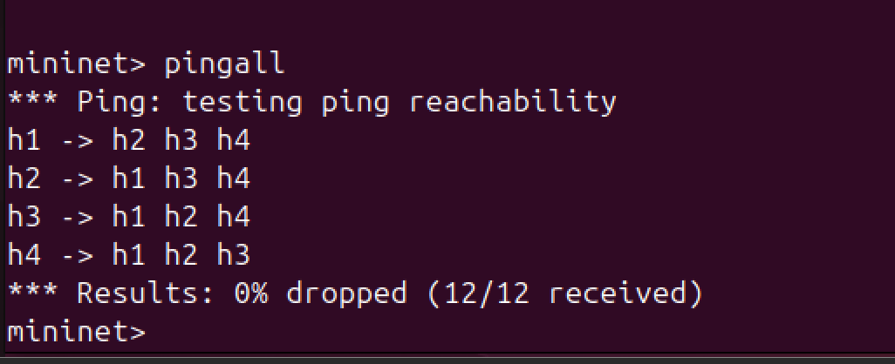
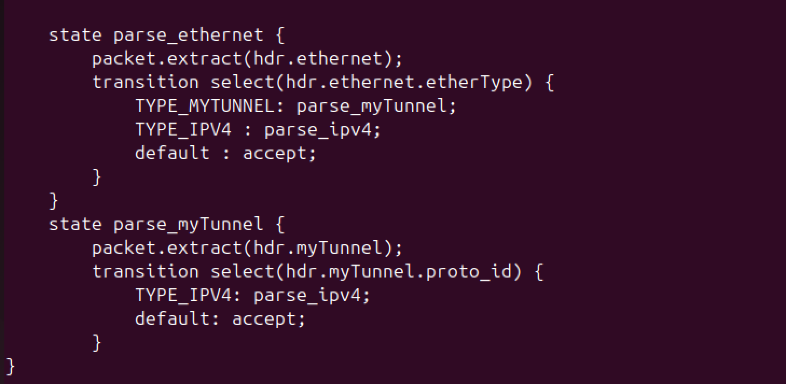
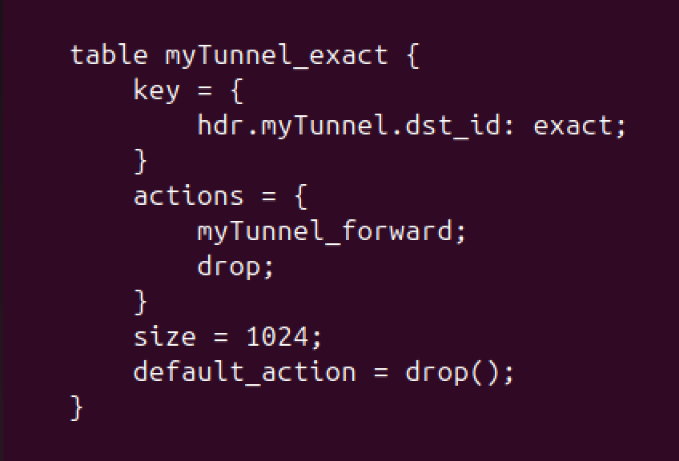
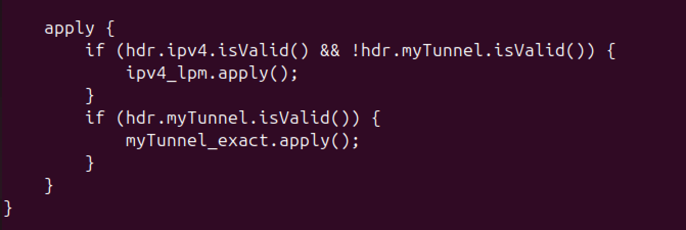
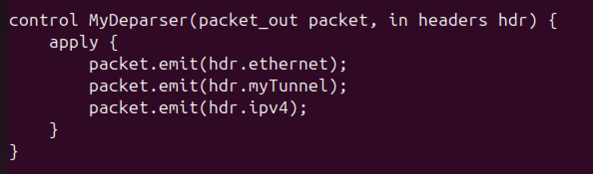
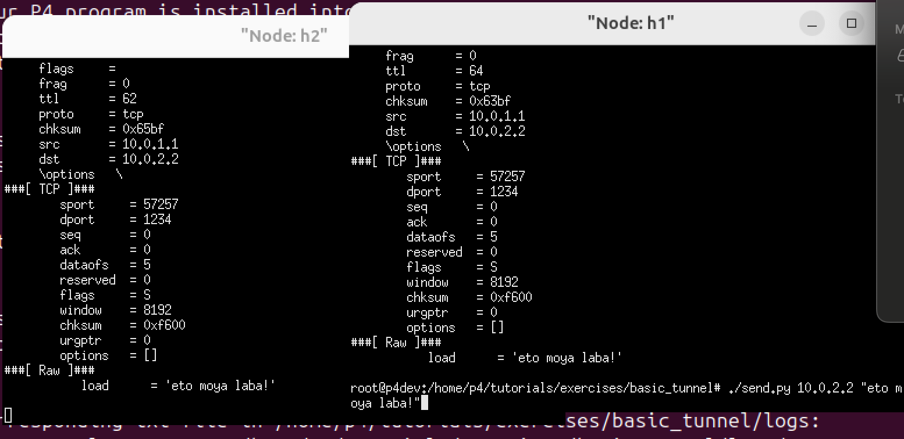
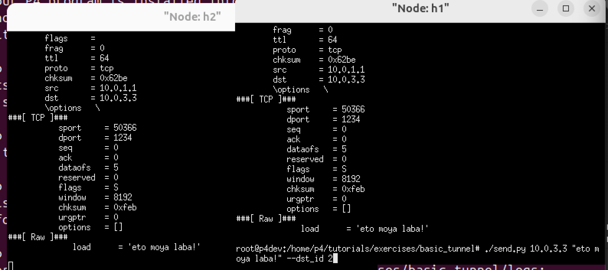

# Лабораторная работа №4 "Базовая 'коммутация' и туннелирование используя язык программирования P4"

University: [ITMO University](https://itmo.ru/ru/)
Faculty: [FICT](https://fict.itmo.ru)
Course: [Network programming]([https://github.com/itmo-ict-faculty/introduction-in-routing](https://itmo-ict-faculty.github.io/network-programming/))
Year: 2024/2025
Group: K3323
Author: Danilenko Dmitriy Alexandrovich
Lab: Lab4
Date of create: 01.06.2025
Date of finished:

## Ход работы

### Basic

Схема для этого задания выглядит следующим образом

Допишем файл [basic.p4](files/basic.p4)

Опишем логику разбора заголовков в парсере

Опишем логику маршрутизации ipv4-пакета - указанием порта, заменой адресов и уменьшением ttl

В deparser допишем добавление заголовка ipv4

Проверим работоспособность

### Basic tunneling

Схема для этого задания выглядит следующим образом

Опишем логику обработки заголовков туннелирования

Опишем таблицу с ключом и действиями, необходимыми для туннелирования, укажем стандартный размер и дефолтное действие

Опишем сценарии использования туннелирования и базовой коммутации

Не забудем добавить соответствующие заголовки

Проверим рабоспособность нашей сети и отправим сообщение на ip, соответствующему h2

Добавим id h2, но ip укажем другой ноды. В результате, благодаря туннелированию, пакет все-равно отправится на h2.

